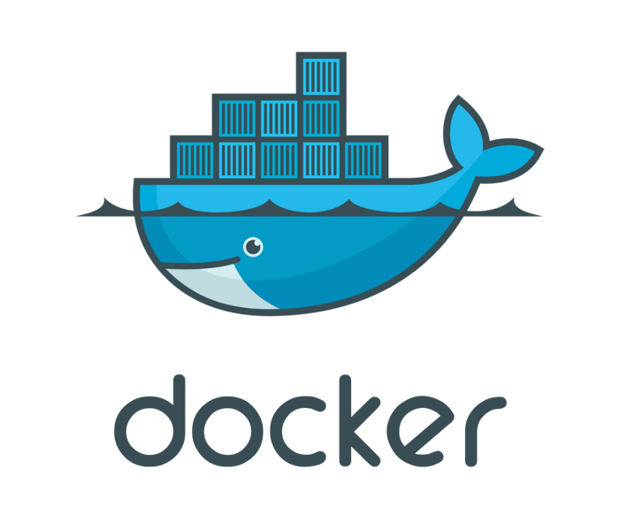

# Introdução ao Docker

### O que é o Docker ?

 O Docker é um conjunto de Softwares, que utiliza **virtualização a nivel  de SO**[1] para criação de ambientes isolados(Containers) para execução de Software de maneira que independentemente da maquina ele seja executado sempre em um ambiente identico com as mesmas bibliotecas, software e Sistema Operacional.

### Como ele funciona ?

De maneira simplificada podemos dividir o docker em 4 blocos que definem sua arquitetura :
- **Docker Client?** A principal parte que o desenvolvedor interage, aqui estão os comandos como o docker run, build e pull. Utiliza a API Docker para se comunicar com o **Daemon**[2] Docker, podendo interagir tambem com Daemons remotos.
- **Docker Daemon:**
- **Docker Registry:**
- **Docker Objects:**

### Como instalar o Docker ?

Adocumentação do docker explica de maneira detalhada como instalar no Windows, MacOs e linux, basta seguir os passos no site de acordo com seu SO

### [Install Docker | Docker docs](https://docs.docker.com/engine/install/)

## Referencia e Links uteis

1. [Virtualização a Nivel de SO - Wikipedia](https://pt.wikipedia.org/wiki/Virtualiza%C3%A7%C3%A3o_em_n%C3%ADvel_de_sistema_operacional)
2. [Daemon (computação) - Wikipedia](https://pt.wikipedia.org/wiki/Daemon_(computa%C3%A7%C3%A3o))
---
- [Play with Docker](https://labs.play-with-docker.com/)
- [O que é virtualização - RedHat](https://www.redhat.com/pt-br/topics/virtualization/what-is-virtualization)
