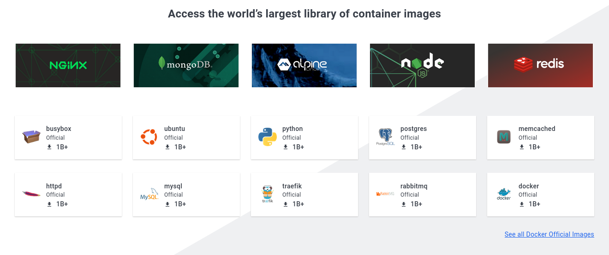

# Imagens
No docker imagens são templates usados para criação de containers, esses templates podem ser usados como disponibilizados ou você pode customiza-los de acordo com suas necessidades. O docker tambem permite que você crie suas proprias imagens a partir de outras ou ate mesmo do zero.

## Docker Hub
O docker hub é um registro publico com milhares de imagens ja prontas dos mais diversos aplicativos e SOs para utilizarmos conforme necessario, acessando pelo link: `https://hub.docker.com/`

Na imagem acima podemos ver algumas das principais imagens docker, servidores web como httpd e nginx, distros linux como busybox e ubuntu. Clicando em alguma delas voce vera mais informações sobre, alem de como baixa-las e utilizar-las.